# keras-resnetCam

## Table of Contents

1. [Project motivation](#project-motivation)
1. [Requirements](#Requirements)
1. [Usage](#usage)
1. [Result](#result)

## Project motivation

This project focuses on keras implementation on ResNet-CAM model. Convolutional Neural Networks (CNNs) with Global Average Pooling (GAP) layers of a pre-trained model has been formallly used for object localization. Earlier 2014, [this paper](https://arxiv.org/pdf/1312.4400.pdf) was released to propose the design of CNNs architecture with GAP layers. The researchers gave insightful advantages of using this spatial pooling layers over convolutional layers before this feature maps are converted to linear vectors and passed to fully connected layers and then sigmoid activation function is used to give the probability of respective potential classes.
[MIT researchers](http://cnnlocalization.csail.mit.edu/Zhou_Learning_Deep_Features_CVPR_2016_paper.pdf) gave well documented and practical technique of CNN with GAP layers (a.k.a GAP-CNNs) that has been trained for image classifiaction tasks for object localization. These papers have been helpful to focus on the use of keras transfer learning that involves the use of pre-trained model that has been trained with different dataset to explicitly make predictions on unseen dataset.
Keras implementation of VGG-CAM has been explored [here](https://github.com/tdeboissiere/VGG16CAM-keras/blob/master/README.md), the idea is to demostrate similar approach that was not presented on the project and thus, uses ResNet50 model to give object localization to supplied object by user. You could watch typical example object localization video [here](https://www.youtube.com/watch?v=fZvOy0VXWAI).

## Requirements

- keras with tensorflow backend (keras version 2.0.0 or later)
- numpy
- ast
- scipy
- matplotlib
- opencv3

## Usage

> git clone https://github.com/Ainard09/Keras_ResNetCAM.git on cmd line

> cd Keras_ResNetCAM

> `python resnetCam.py images/scooter.jpeg`

## Result

Examples of model,making object classification and localization

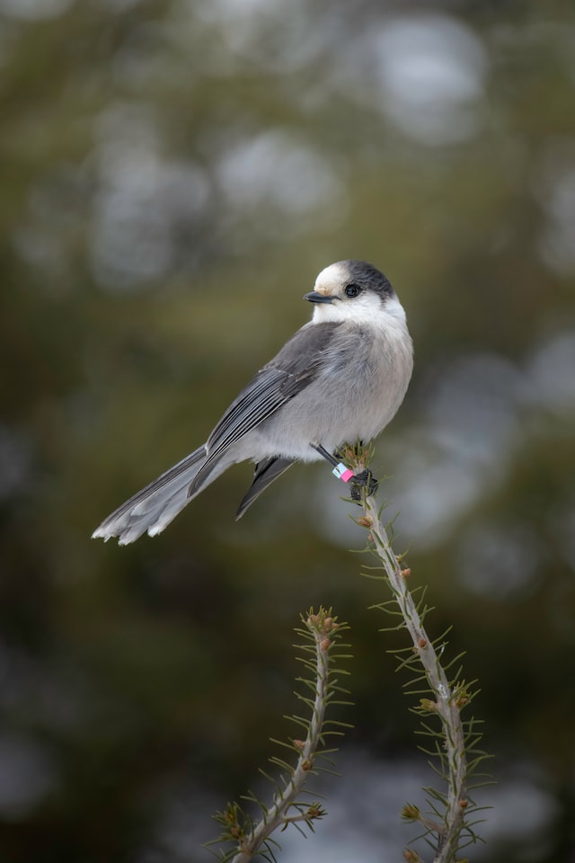 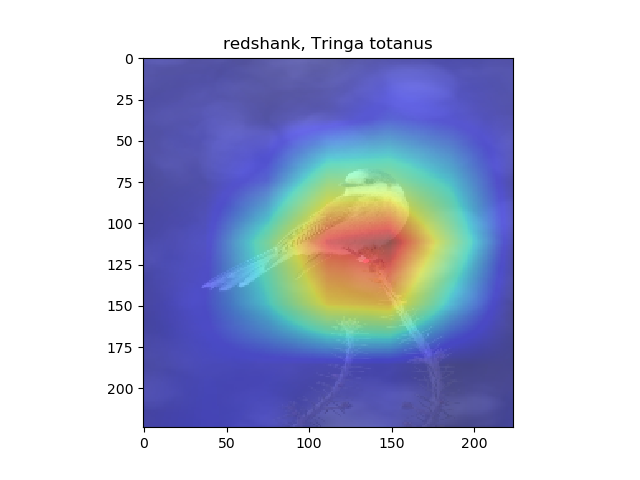

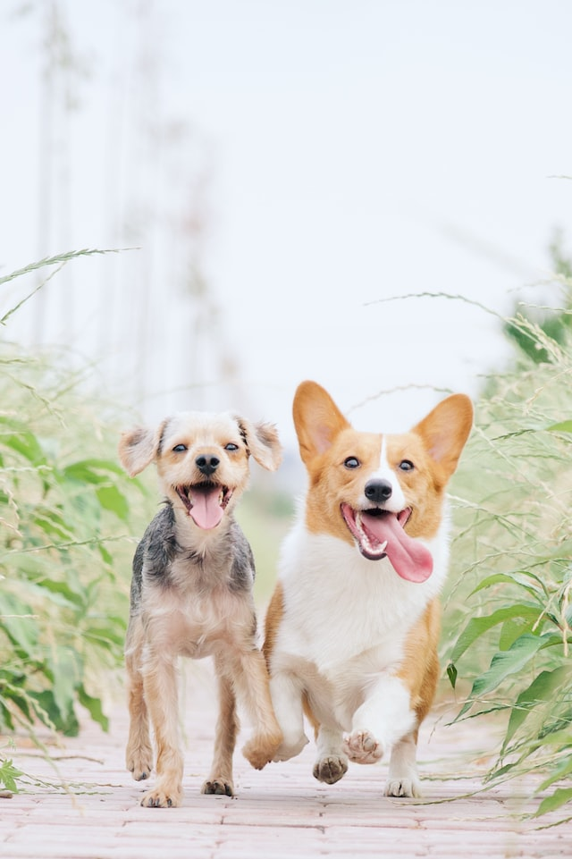 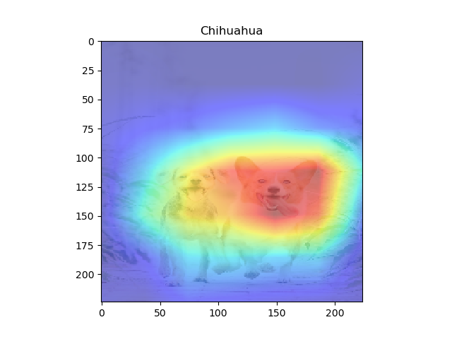

 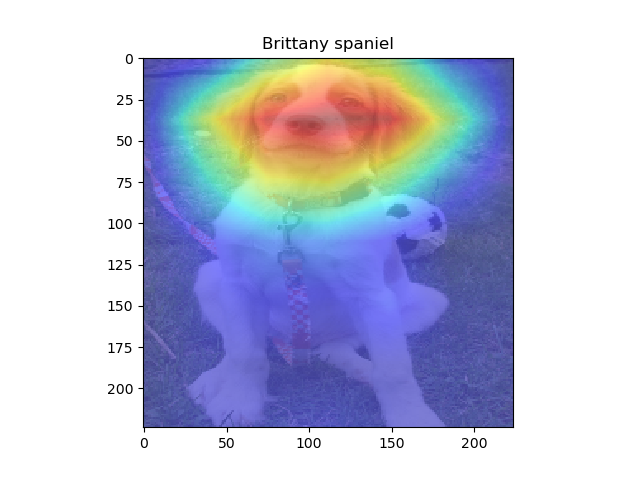

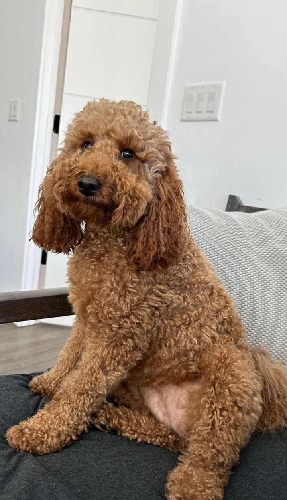 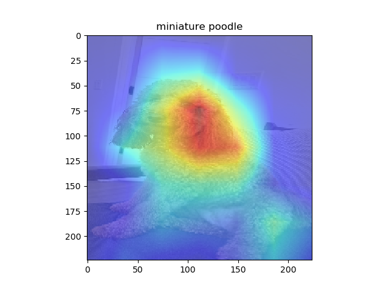

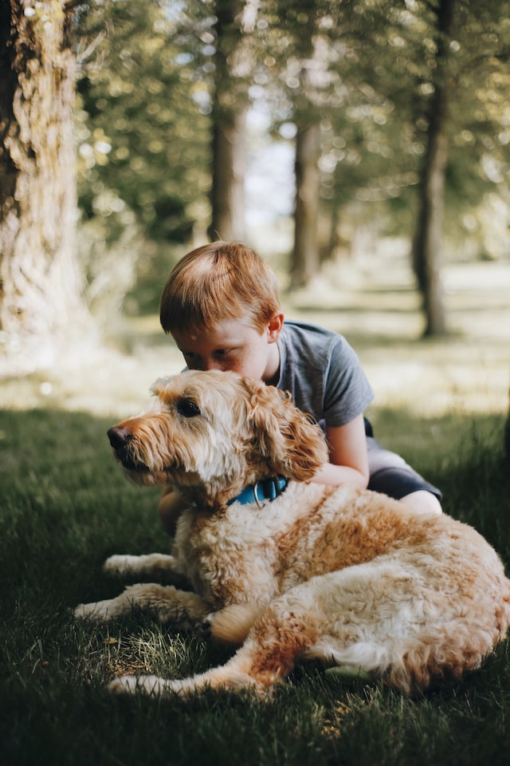 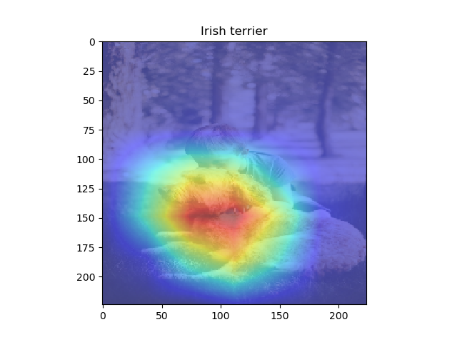

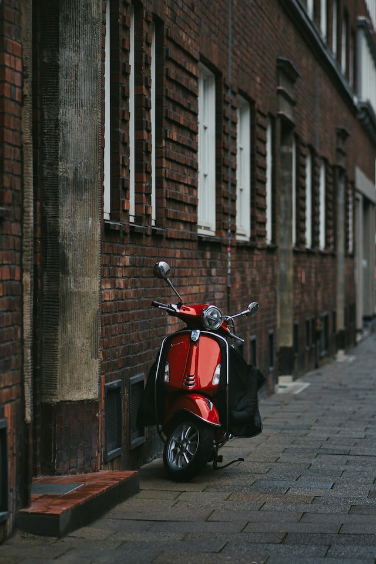 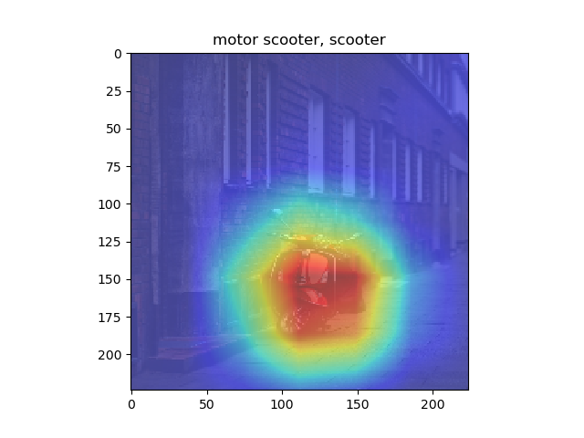
